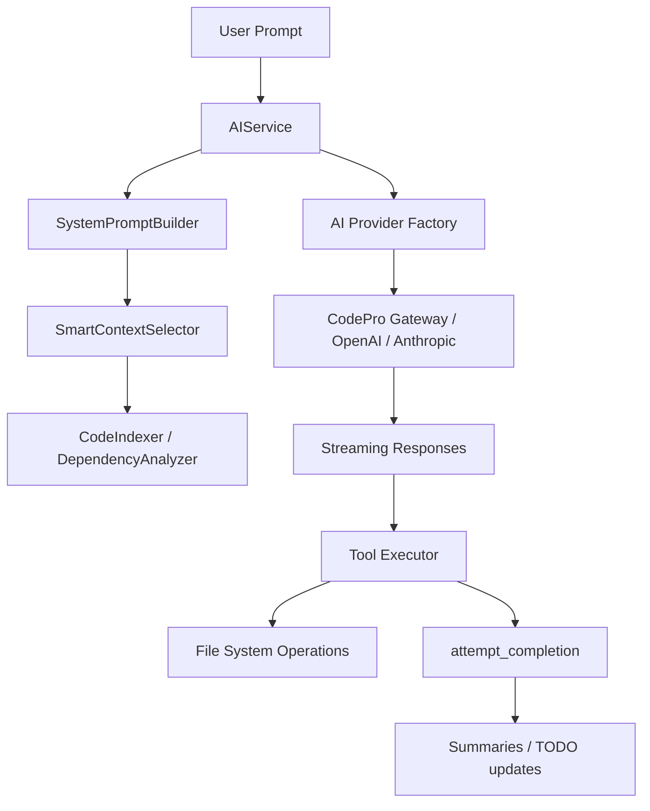

# RooCode-For-iOS

# RootCoder-Vibe Coding

  

  <strong>AI-native IDE for iPhone & iPad • SwiftUI • iOS 18 aesthetics</strong>

  
  
  
  

## 🌟 Overview

RootCoder-Vibe Coding is the first **AI-native IDE crafted specifically for iPhone and iPad**. Built with the latest SwiftUI patterns and iOS 18 visual design, RootCoder combines a tactile editing experience with an autonomous AI coding companion capable of understanding your project, manipulating files safely, and delivering complete features on the go.

- **Mobile-first power** – Full-featured code editing, project navigation, and AI pair-programming optimized for multi-touch, Apple Pencil, and Stage Manager.
- **Autonomous AI Agent** – Inspired by the Cline architecture with a continuous `while(true)` planning loop, sequential tool execution, and explicit completion signals.
- **Per-project RAG** – Intelligent context retrieval scoped to each project using semantic search, dependency analysis, and token budgeting.
- **Production-grade pipelines** – Seamless artillery between mobile ideation and desktop deployment with cloud sync and secure gateways.

> Build anywhere. Iterate anywhere. Ship anywhere — directly from your iPhone or iPad.

## ✨ Product Highlights

| Experience | Why it matters |
|------------|----------------|
| **AI-first IDE** | Conversational coding with live tool execution, automated diffs, and precise file edits. |
| **iOS 18 design language** | Glassmorphism, material gradients, and fluid motion deliver a modern, premium workspace. |
| **Touch-native editor** | Gesture-driven selection, pinch-to-zoom previews, and Apple Pencil annotations keep you in flow. |
| **Instant context** | Smart Context (RAG) pulls in the most relevant files per query—no manual copy/paste. |
| **Run-anywhere projects** | Manage Swift, JS/TS, Python, and web stacks with project-aware templates. |
| **Offline-first UX** | Local semantic embeddings and caching let you stay productive without perfect connectivity. |

## 🧠 Technical Advantages

### Autonomous AI Engine
- **Cline-style agent loop**: Continuous reasoning until `attempt_completion` is triggered; no hard-coded depth limits.
- **Sequential tool execution**: Ensures safe file operations (create → edit → verify) with deterministic ordering.
- **Per-tool streaming UI**: Real-time tool progress indicators and structured output rendering.

### Project-aware RAG
- **Isolated context** per project path (`CodeIndexer.projectIndexCache[projectPath]`).
- **Dependency graph** caching (`DependencyAnalyzer.dependencyGraphCache[projectPath]`) to surface related files.
- **Token budgeting** (8K / 16K plans) with intelligent truncation for large codebases.

### Cloud & Gateway Integrations
- **CodePro gateway** with server-managed model routing (Anthropic Claude 4.5, OpenAI, DeepSeek, Gemini).
- **Quota intelligence**: Dynamic switching between premium and free models based on usage (20K → 15K threshold).
- **Test harness**: Built-in shell scripts for gateway validation and diagnostics.

### Secure-by-design
- On-device semantic search (Apple NLEmbedding).
- iCloud-backed quota sync to prevent abuse and ensure continuity.
- No sensitive model credentials stored client-side.

## 📱 Crafted for iPhone & iPad

| Platform | Delightful details |
|----------|-------------------|
| **iPhone** | Quick Actions on Dynamic Island, one-handed chat-driven coding, and haptic-coded feedback loops. |
| **iPad** | Stage Manager multi-window layout, split-view file comparison, and Apple Pencil inline annotations. |
| **Universal** | 120Hz ProMotion-ready animations, accessibility support (VoiceOver, Dynamic Type), and seamless handoff to desktop. |

## 🧩 Architecture at a Glance

## 🛠️ Tech Stack

| Layer | Tech |
|-------|------|
| **UI** | SwiftUI, Material Effects, SF Symbols 6 |
| **Core** | Swift Concurrency (async/await), Combine, structured logging |
| **AI** | Cline-inspired agent loop, Smart Context RAG, NLEmbedding semantic search |
| **Networking** | URLSession, iCloud |
| **Storage** | iCloud sync, UserDefaults, sandboxed project workspace |

## 🚀 Getting Started

1. **Download** RootCoder-Vibe Coding on the App Store:  
   <a href="https://apps.apple.com/us/app/rootcoder-vibe-coding/id6754330825?platform=iphone">https://apps.apple.com/us/app/rootcoder-vibe-coding/id6754330825?platform=iphone</a>
2. Sign in with your Apple ID (no extra accounts required).
3. Import an existing repository or start from curated templates.
4. Launch the AI companion and watch it ship features autonomously.

## 🗺️ Roadmap Highlights

- Interactive design co-pilot with Core ML & Vision integration.
- Inline tests and previews powered by Swift Playgrounds.
- Git providers (GitHub, GitLab, Bitbucket) with secure commit signing.
- Collaboration mode for pair-programming across devices.

## 🤝 Community & Support

We would love to hear from you! Whether it’s feature ideas, bug reports, or success stories:
- File issues and discussions on GitHub (coming soon)
- Reach the team via email: <support@aicnbc.com>
- Share your builds with `#RootCoderVibe`

---

  Crafted with ❤️ for developers who code wherever inspiration strikes.

